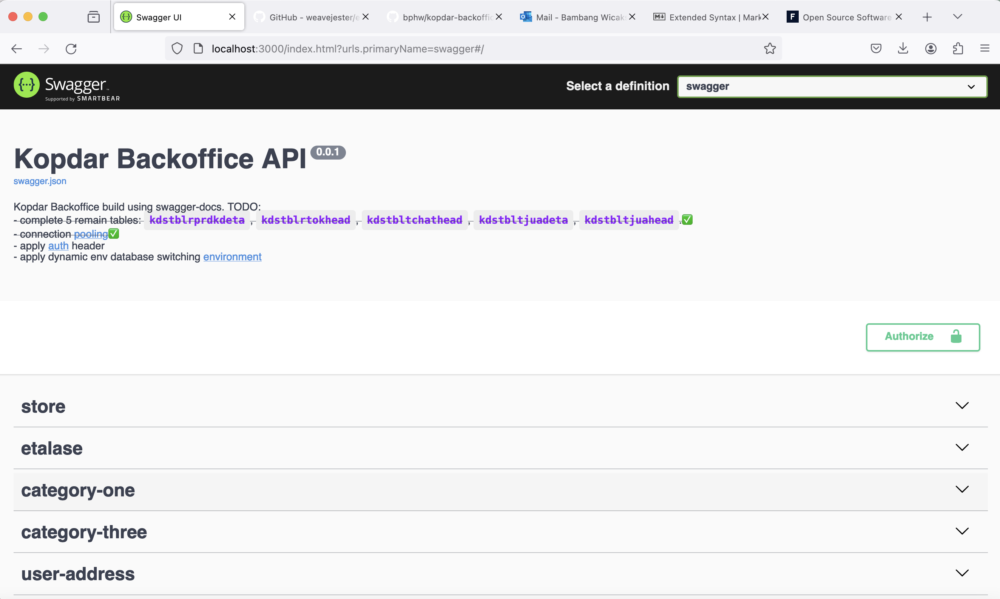

# http-swagger for Kopdar Backoffice

This apps only contain of API with data source taken from `skalakid_skw` database which store on this address:

- localhost
- 192.3.228.147

Table covered so far (another upcoming tables might comes):

- kdstblalmtuser
- kdstblmastetls
- kdstblmastkat1
- kdstblmastkat2
- kdstblmastkat3
- kdstblmastmethbayr
- kdstblmastpengiriman
- kdstblmastprdk
- kdstblmasttoko
- kdstblmasttranstat
- kdstblmastugrp
- kdstblmastuser
- kdstblrprdkdeta
- kdstblrtokhead
- kdstbltchathead
- kdstbltjuadeta
- kdstbltjuahead

## Installation

- cd ~/Downloads or ===your–preferred–local-directory===
- git clone `https://github.com/bphw/kopdar-backoffice-api`
- cd clojure-http-swagger-kopdar
- $ lein repl

## Usage

To run on single .jar file, do `lein install` (later as this not implemented yet)

    $ java -jar http-swagger-0.1.0-standalone.jar [args]

To start server

    server.core> (start)

Open your browser and navigate to [localhost](http://192.3.228.147:3000/index.html) and choose `swagger` on _Select a definition_ drop down.

To stop server

    server.core> (stop)

## Options

FIXME: listing of options this app accepts.

## Examples

...

### Bugs

### Any Other Sections

### That You Think

### Might be Useful

## License

Copyright © 2024 Bambang Puji Haryo

This program and the accompanying materials are made available under the
terms of the Eclipse Public License 2.0 which is available at
http://www.eclipse.org/legal/epl-2.0.

This Source Code may also be made available under the following Secondary
Licenses when the conditions for such availability set forth in the Eclipse
Public License, v. 2.0 are satisfied: GNU General Public License as published by
the Free Software Foundation, either version 2 of the License, or (at your
option) any later version, with the GNU Classpath Exception which is available
at https://www.gnu.org/software/classpath/license.html.
